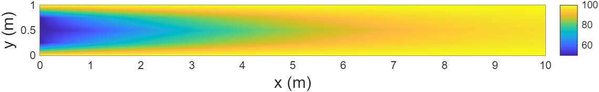
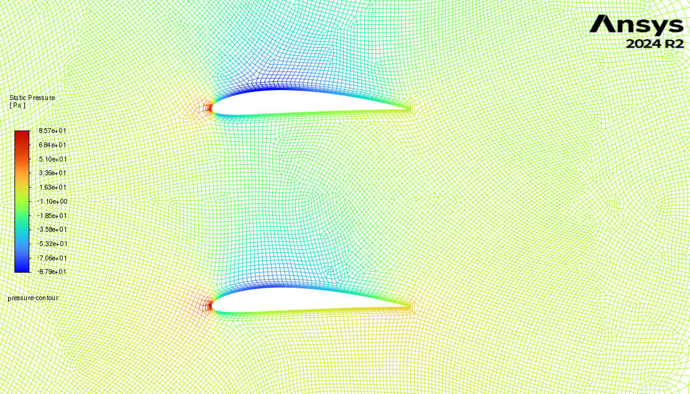

# Numerical Flow Simulation

Collaborative coursework completed for **ME-474 — Numerical Flow Simulation** at **EPFL** during the **Fall 2025 semester**.

**Team:** Stefano Bernasconi, Francesco Derme, Pietro Fumagalli, and Yanpeng Zhang.

This repository collects two complementary computational fluid-dynamics projects:

1. a MATLAB finite-volume solver for steady heat transport in a plane channel;
2. an Ansys Fluent investigation of the aerodynamic performance of single and multi-airfoil configurations.

The repository is organized as a portfolio copy of the original course work. It highlights the numerical methods, validation procedures, and physical interpretation developed by the group.

---

## Project 1 — Finite-volume solver for channel heat transfer

<p align="center">
  
</p>

The first project develops a two-dimensional solver in **MATLAB** for the steady advection–diffusion equation governing a passive temperature field in a plane channel with fully developed laminar flow.

### Main developments

- derivation of the finite-volume balance on a structured Cartesian mesh;
- assembly of the global linear system from control-volume coefficients;
- implementation of Dirichlet, Neumann, and mixed wall boundary conditions;
- first-order upwind and QUICK discretizations for convective fluxes;
- direct solution with MATLAB and an explicit Successive Over-Relaxation solver;
- monitoring of relative iteration errors and normalized residuals;
- mesh-refinement studies in the streamwise and transverse directions;
- computation of thermal entry length, velocity-weighted mean temperature, and local Nusselt number;
- sensitivity analysis with respect to the Péclet number;
- verification of the global thermal-energy balance;
- localized wall-heating experiments with prescribed outlet-temperature targets.

The project also examines numerical artifacts caused by outlet boundary conditions and shows that transverse refinement is particularly important for accurately resolving wall-normal temperature gradients.

**Files**

- [MATLAB implementation](code/finite_volume_channel_solver.m)
- [Project report](reports/finite_volume_channel_solver_report.pdf)

---

## Project 2 — NACA 4412 single- and multi-airfoil CFD study

<p align="center">
  
</p>

The second project studies the flow around a **NACA 4412** airfoil using **Ansys Fluent 2024 R2**. A single-airfoil reference configuration is first established and then compared with tandem and vertically stacked two-airfoil arrangements.

### Numerical setup

- two-dimensional, steady, incompressible Reynolds-averaged Navier–Stokes equations;
- Spalart–Allmaras turbulence model;
- C-type far-field domain;
- hybrid mesh with near-wall quadrilateral inflation layers and an unstructured far field;
- wall resolution designed for approximately unit wall distance;
- pressure-based coupled solver with second-order spatial discretization;
- simulations over angles of attack from -8° to 24°;
- mesh-convergence analysis using coarse, medium, and fine grids.

### Quantities investigated

- lift and drag coefficients;
- lift-to-drag ratio;
- surface pressure-coefficient distributions;
- static-pressure contours;
- velocity fields and wake development;
- flow attachment, separation, and stall onset;
- aerodynamic interference between multiple lifting surfaces.

The comparison identifies two main interference mechanisms:

- **tandem configuration:** the rear airfoil is affected by the wake, velocity deficit, and downwash generated by the front airfoil;
- **biplane configuration:** the confined inter-wing flow modifies the pressure fields on the facing surfaces and reduces the effective lift-generating pressure difference.

The report also documents the limitations of steady RANS simulations in the post-stall regime and compares the numerical trends with published computational and experimental references.

**File**

- [Airfoil study report](reports/multi_configuration_airfoil_study.pdf)

---

## Repository structure

```text
.
├── README.md
├── code/
│   └── finite_volume_channel_solver.m
├── figures/
│   ├── biplane_pressure_contour.png
│   └── channel_temperature_field.png
└── reports/
    ├── finite_volume_channel_solver_report.pdf
    └── multi_configuration_airfoil_study.pdf
```

## Running the MATLAB study

Open `code/finite_volume_channel_solver.m` in MATLAB and run the complete script or the individual sections marked in the file. The physical parameters, mesh sizes, boundary conditions, and Péclet number can be modified near the beginning of the script.

The implementation intentionally assembles the finite-volume system explicitly for clarity. Fine meshes therefore require substantially more memory than an equivalent sparse implementation.

## Reproducibility and scope

The MATLAB project is reproducible from the included source file and has no external data dependency.

The native Ansys project, mesh, case, and data files are not included in this portfolio repository. The complete numerical setup, convergence criteria, mesh specifications, validation procedure, and results are documented in the corresponding report.

## Authorship

This work was completed collaboratively by the four team members listed above. Its inclusion in a personal GitHub portfolio does not imply exclusive authorship by the repository maintainer.

## Usage

The material is provided for academic and portfolio purposes. No explicit open-source license is granted unless one is added separately.
